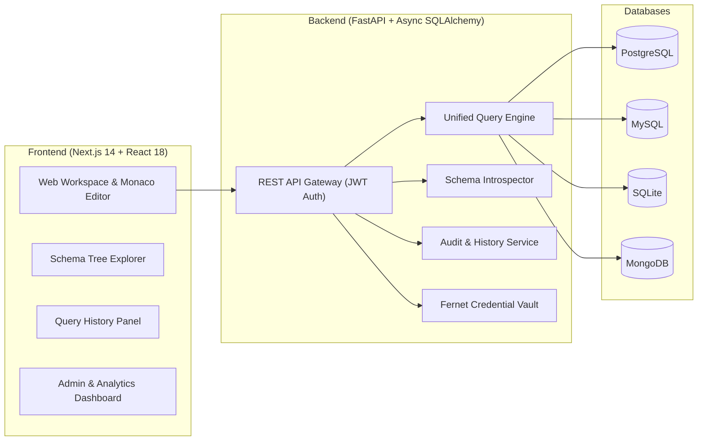

# 📓 Collaborative Database Notebook

<div align="center">

[](https://fastapi.tiangolo.com)
[](https://nextjs.org/)
[](https://www.typescriptlang.org/)
[](https://www.python.org/)
[](https://www.docker.com/)
[](https://github.com)
[](LICENSE)

<p align="center">
  A modern, high-performance, collaborative web notebook platform for querying, analyzing, and documenting relational and NoSQL databases in a unified interactive workspace.
</p>

[Key Features](#-key-features) •
[Architecture](#-system-architecture) •
[Supported Databases](#-supported-databases) •
[Quick Start](#-quick-start) •
[Security](#-security-architecture) •
[API Documentation](#-api-documentation) •
[Deployment](#-production-deployment)

</div>

---

## 🌟 Overview

**Collaborative Database Notebook** bridges the gap between traditional database GUIs and interactive computational notebooks (like Jupyter). It provides data engineers, developers, and analysts with a unified, browser-based environment where they can manage multiple database connections, write and execute SQL or NoSQL queries, introspect live schemas, document workflows using Markdown, and audit query execution logs across the organization.



---

## ✨ Key Features

- **Interactive Cell-Based Execution**: Create multiple query cells (SQL or Markdown) with Monaco Editor integration, syntax highlighting, keyboard shortcuts (`Ctrl+Enter`), and per-cell execution timers.
- **Multi-Engine Database Support**: Native asynchronous connectors for **PostgreSQL**, **MySQL**, **SQLite**, and **MongoDB**.
- **Real-Time Schema Explorer**: Live database introspection tree view displaying tables, collections, views, primary keys, and data types with single-click clipboard copying.
- **Query Execution History & Auditing**: Comprehensive logging of executed queries, execution durations, row counts, and error diagnostics with instant copy and re-run actions.
- **In-App Interactive Learning Hub**: Built-in comprehensive guides and tutorials for all supported database engines with progress tracking per section.
- **Enterprise Role-Based Access Control (RBAC)**: Secure user management, role assignments (`user` vs `admin`), and administrative audit trails with platform analytics.
- **Credential Encryption at Rest**: Symmetric AES-128-CBC (Fernet) encryption for all database connection passwords and connection strings.
- **Modern Glassmorphic Dark UI**: Tailored interface built with fluid micro-interactions, responsive sidebars, and accessible component palettes.

---

## 🗄️ Supported Databases

| Engine | Async Driver | Query Syntax | Schema Introspection |
|---|---|---|---|
| **PostgreSQL** | `asyncpg` | Standard ANSI SQL / PostgreSQL Dialect | `information_schema` tables, columns, data types |
| **MySQL** | `aiomysql` | MySQL Dialect / `SHOW`, `DESCRIBE` | Information schema tables, views, and field types |
| **SQLite** | `aiosqlite` | SQLite SQL / `PRAGMA` Commands | Table metadata, index analysis, column types |
| **MongoDB** | `motor` | Structured JSON Command Objects | Collection discovery & document field sampling |

### MongoDB Query Format Example
```json
{
  "operation": "find",
  "collection": "users",
  "filter": { "role": "admin" },
  "limit": 25
}
```
*Supported operations: `find`, `insertOne`, `updateMany`, `deleteOne`, `aggregate`.*

---

## 🏗️ Tech Stack

### Frontend
- **Framework**: [Next.js 14](https://nextjs.org/) (App Router, Server & Client Components)
- **Language**: [TypeScript 5](https://www.typescriptlang.org/)
- **Styling**: Vanilla CSS Design Tokens + Custom Glassmorphic System
- **Code Editor**: [@monaco-editor/react](https://github.com/suren-atoyan/monaco-react)
- **Icons & Visuals**: Lucide Icons & SVG Glyphs

### Backend
- **Framework**: [FastAPI](https://fastapi.tiangolo.com/) (ASGI, Python 3.11+)
- **ORM & Database**: [SQLAlchemy 2.0 (Asyncio)](https://www.sqlalchemy.org/) + [Alembic](https://alembic.sqlalchemy.org/)
- **Validation**: [Pydantic v2](https://docs.pydantic.dev/) + [Pydantic Settings](https://docs.pydantic.dev/latest/concepts/pydantic_settings/)
- **Security & Crypto**: `python-jose` (JWT), `bcrypt`, `cryptography.fernet`
- **Database Drivers**: `asyncpg`, `aiomysql`, `aiosqlite`, `motor`, `pymongo`

---

## 🚀 Quick Start

### Option 1: Docker Compose (Recommended)

Run the complete multi-container stack (PostgreSQL database, FastAPI backend, and Next.js frontend) with a single command:

```bash
# Clone the repository
git clone https://github.com/itz-Maheshkumar/Collaborative_Database_Notebook.git
cd Collaborative_Database_Notebook

# Start all services
docker compose up --build
```

- **Frontend**: [http://localhost:3000](http://localhost:3000)
- **Backend API**: [http://localhost:8000](http://localhost:8000)
- **Interactive OpenAPI Docs**: [http://localhost:8000/docs](http://localhost:8000/docs)

---

### Option 2: Local Development Setup

#### 1. Backend Setup

```bash
cd backend

# Create and activate a virtual environment
python -m venv .venv
source .venv/bin/activate  # On Windows: .venv\Scripts\activate

# Install dependencies
pip install -r requirements.txt

# Configure environment variables
cp .env.example .env

# Start the FastAPI server
uvicorn app.main:app --reload --port 8000
```

#### 2. Frontend Setup

```bash
cd frontend

# Install Node dependencies
npm install

# Run the development server
npm run dev
```

Visit [http://localhost:3000](http://localhost:3000) in your browser.

---

## ⚙️ Environment Configuration

### Backend (`backend/.env`)

| Variable | Default Value | Description |
|---|---|---|
| `DATABASE_URL` | `sqlite+aiosqlite:///./collaborative_db.sqlite` | SQLAlchemy connection string for the application store |
| `SECRET_KEY` | `supersecretkey_change_in_production` | Secret key used for signing JWT access tokens |
| `ALGORITHM` | `HS256` | JWT signing algorithm |
| `ACCESS_TOKEN_EXPIRE_MINUTES` | `1440` | Token expiration duration (in minutes) |
| `FERNET_KEY` | *(auto-generated)* | 32-byte base64 key for symmetric database credential encryption |
| `FRONTEND_ORIGIN` | `http://localhost:3000` | Allowed CORS origin for browser clients |

### Frontend (`frontend/.env.local`)

| Variable | Default Value | Description |
|---|---|---|
| `NEXT_PUBLIC_API_URL` | `http://localhost:8000` | Base URL of the backend REST API |

---

## 🔐 Security Architecture

- **Credential Encryption at Rest**: Passwords and sensitive connection tokens for external databases are encrypted using Fernet (AES-128 in CBC mode with HMAC SHA256 authentication) before persisting to storage.
- **Authentication**: Stateless JWT bearer tokens with secure bcrypt password hashing.
- **Role-Based Authorization**: Hierarchical permission levels (`user` and `admin`) with route-level middleware protection.
- **Injection Mitigation**: Relational queries execute via isolated async database driver interfaces, preventing SQL injection against the application database.

---

## 📡 API Documentation

FastAPI automatically generates interactive OpenAPI 3.0 documentation:

- **Swagger UI**: [http://localhost:8000/docs](http://localhost:8000/docs)
- **ReDoc**: [http://localhost:8000/redoc](http://localhost:8000/redoc)

### Core Endpoints

```
Authentication
  POST   /api/v1/auth/register      Register a new user account
  POST   /api/v1/auth/login         Authenticate and receive JWT token
  GET    /api/v1/auth/me            Fetch current user profile

Connection Management
  GET    /api/v1/connections        List configured database connections
  POST   /api/v1/connections        Create a database connection
  GET    /api/v1/connections/{id}   Retrieve connection details
  DELETE /api/v1/connections/{id}   Delete connection
  POST   /api/v1/connections/{id}/test Test database connectivity

Notebook Workspace
  GET    /api/v1/notebooks          List user notebooks
  POST   /api/v1/notebooks          Create notebook
  GET    /api/v1/notebooks/{id}     Get notebook with cells
  PATCH  /api/v1/notebooks/{id}     Update notebook title/metadata
  DELETE /api/v1/notebooks/{id}     Delete notebook

Query & Introspection Engine
  POST   /api/v1/query/execute      Execute SQL/NoSQL query on connection
  GET    /api/v1/query/history      Retrieve execution audit logs
  DELETE /api/v1/query/history      Clear query execution history
  GET    /api/v1/schema/{conn_id}   Introspect live database schema tree

Learning Hub & Admin
  GET    /api/v1/tutorials/progress Get tutorial section completions
  POST   /api/v1/tutorials/progress Mark section as completed
  GET    /api/v1/admin/analytics    Platform-wide performance & query metrics
  GET    /api/v1/admin/users        User administration table (Admin only)
  GET    /api/v1/admin/audit-logs   Global query execution audit log (Admin only)
```

---

## 🧪 Testing & Quality Assurance

### Run Backend Tests
```bash
cd backend
pytest -v
```

### Run Frontend Type-Checking & Linting
```bash
cd frontend
npm run type-check
npm run lint
```

### Production Build Validation
```bash
cd frontend
npm run build
```

---

## 📦 Production Deployment

### Automated CI/CD
The repository includes GitHub Actions automation workflows located in [`.github/workflows`](.github/workflows):
- **Continuous Integration (`ci.yml`)**: Automated backend linting (`ruff`), async unit tests (`pytest` with live PostgreSQL test container), frontend type checking (`tsc`), Next.js bundle compilation, and Docker image build verification.
- **Continuous Deployment (`cd.yml`)**: Automated multi-architecture container packaging published to GitHub Container Registry (`ghcr.io`) upon tag releases with automated staging and production release gates.

---

## 📄 License

This project is licensed under the **MIT License** — see the [LICENSE](LICENSE) file for details.